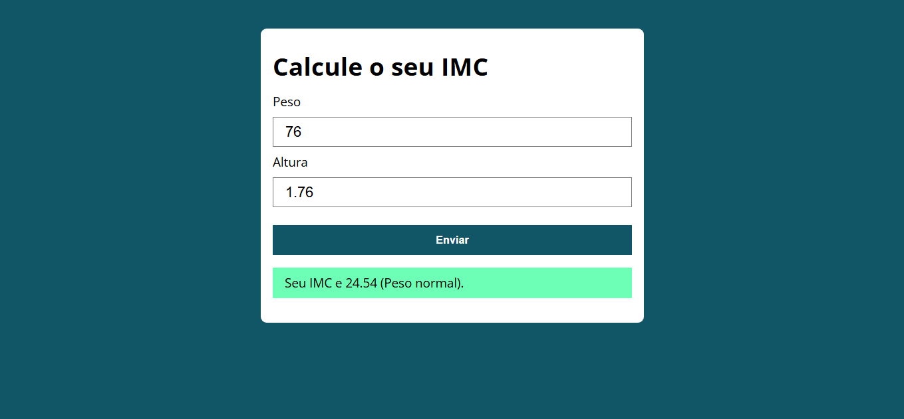

# 🧮 Calculadora de IMC

Projeto desenvolvido utilizando **HTML, CSS e JavaScript**, com o objetivo de calcular o Índice de Massa Corporal (IMC) a partir do peso e da altura informados pelo usuário.

## 🚀 Funcionalidades

* Cálculo automático do IMC.
* Validação dos campos de peso e altura.
* Exibição da classificação correspondente ao resultado.
* Interface simples e intuitiva.

## 📋 Classificações utilizadas

* Abaixo do peso
* Peso normal
* Sobrepeso
* Obesidade grau I
* Obesidade grau II
* Obesidade grau III

## 🛠️ Tecnologias utilizadas

* HTML5
* CSS3
* JavaScript (ES6)

## 🎯 Objetivo do projeto

Este projeto foi desenvolvido durante meus estudos de JavaScript com o objetivo de praticar:

* Manipulação do DOM;
* Eventos de formulário;
* Validação de dados;
* Criação de funções;
* Estruturas condicionais;
* Boas práticas de organização de código.

## 📷 Demonstração

## 👨‍💻 Autor

Guilherme Reis

LinkedIn: ([https://www.linkedin.com/in/guilherme-reis-997602382/])
